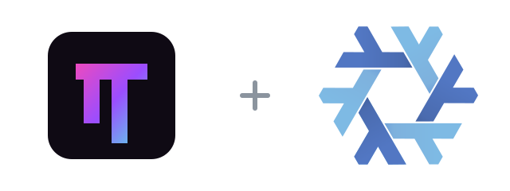

<p align="center">
  
</p>

<h1 align="center">oh-my-pi-flake</h1>

<p align="center">
  <a href="flake.nix"></a>
  <a href="LICENSE"></a>
</p>

[Oh My Pi](https://github.com/can1357/oh-my-pi) is a coding agent with an interactive terminal, tools, sessions, and extension support. This flake builds its `omp` executable from the locked upstream source for NixOS and other Nix users.

Run it without installing:

```sh
nix run github:Fractal-Tess/oh-my-pi-flake
```

Build it without running:

```sh
nix build github:Fractal-Tess/oh-my-pi-flake#omp
```

## Install in a Nix configuration

Add the flake input:

```nix
inputs.omp-flake.url = "github:Fractal-Tess/oh-my-pi-flake";
```

Use the NixOS or Home Manager module:

```nix
# NixOS
{
  imports = [ inputs.omp-flake.nixosModules.default ];
  programs.omp.enable = true;
}

# Home Manager
{
  imports = [ inputs.omp-flake.homeManagerModules.default ];
  programs.omp.enable = true;
}
```

The module defaults to the flake's canonical `omp` package. To select a
package explicitly, set `programs.omp.package`, for example
`inputs.omp-flake.packages.${pkgs.system}.omp`.

The default overlay remains available when you prefer `pkgs.omp`:

```nix
{
  nixpkgs.overlays = [ inputs.omp-flake.overlays.default ];
  environment.systemPackages = [ pkgs.omp ];
}
```

OMP keeps its own settings and sessions under `~/.omp`; installing this package
does not manage or migrate that data.

## Update

The upstream source is pinned in `flake.lock`. Update that input and inspect the resulting diff:

```sh
nix flake update source
nix flake check
```

The current locked coding-agent package version is `18.1.21`.

## Credits and mirrors

[GitHub](https://github.com/Fractal-Tess/oh-my-pi-flake) · Gitadel: `ssh://git@neo.netbird.cloud:2222/fractal-tess/oh-my-pi-flake.git`

The flake packaging is [MIT](LICENSE). Oh My Pi is also [MIT licensed](https://github.com/can1357/oh-my-pi/blob/main/LICENSE), © 2025 Mario Zechner, © 2025–2026 Can Bölük, and © 2026 Stencil Labs, Inc.

The logo combines the [Oh My Pi web app icon](https://github.com/can1357/oh-my-pi/blob/main/packages/collab-web/public/favicon.svg) with the [Nix snowflake](https://github.com/NixOS/nixos-artwork/tree/master/logo) by Simon Frankau and Tim Cuthbertson ([CC BY 4.0](https://creativecommons.org/licenses/by/4.0/)), resized and arranged here. Original geometry and colors are retained.
